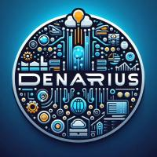

# Denarius Data

  

Experiência sem fronteiras.

* [Missão](#missão)
* [Visão](#visão)
* [Valores](#valores)

# Missão

Facilitar o acesso e a compreensão dos princípios da programação e lógica de algoritmos através da plataforma Visualg, capacitando indivíduos a desenvolverem habilidades essenciais para a resolução de problemas computacionais e impulsionando a inovação e o desenvolvimento tecnológico.

# Visão

Nossa visão é nos tornarmos referência na área em que atuamos, valorizando a integração das funções de nossos colaboradores e compreendendo que o funcionamento de uma área de uma instituição não começa nem termina em si mesma.

# Valores

O respeito por hierarquias, a excelência em serviços, a dedicação e o comprometimento com o desenvolvimento organizacional. Além disso, a empresa valoriza a ética, a integridade e a transparência em todas as suas ações.

### Projeto Integrador do 1º Semestre de Banco de Dados da Fatec de São José dos Campos

 

## 🙅‍♂️ Equipe

#### **Equipe Denarius Data**

#### **Integrantes:** 
- Beatriz Carvalho
- Beatriz Sthefanny Araujo Santos
- Clarice Costa
- Larissa Claro
- Luiz Silva
- Mariana Oliveira
- Rafael Slivka
- Tiago Bernardo Santos
- Thiago

 

## 👨‍💻 Tecnologias

#### Foram utilizadas as seguintes tecnologias:

- **Programação:** VisualG

 

## 🕛 Cronograma

<a fazer>Sprint 1: 25/03 - 14/04 </a> 
<a fazer>Sprint 2: 15/09 - 05/05</a> 
<a fazer>Sprint 3: 06/05 - 26/05</a> 
<a fazer>Sprint 4: 27/05 - 16/06</a>  

 

## 📃 Backlog

<a exemplo>Backlog</a> 

 

## ℹ️ Como usar a aplicação

### Pré-requisitos

